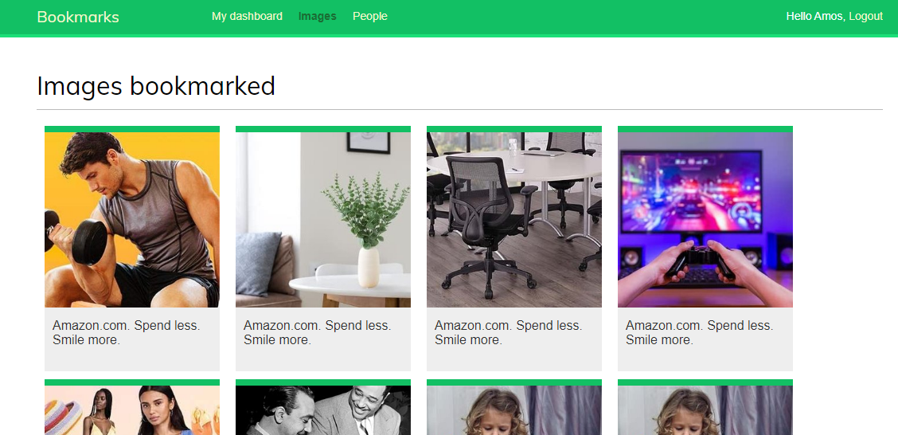
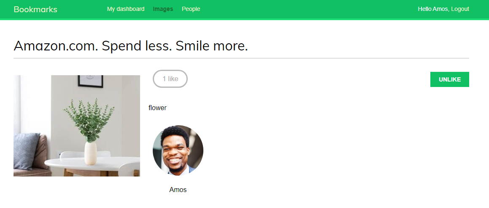

## This is a social website to bookmark and share images - Made in Django

| List view                                       | Detail view                                          |
| ----------------------------------------------- | ---------------------------------------------------- |
|  |  |

The features of this application are:

- Implements authentication using the Django authentication framework.
- Uses Django messages framework for status messages.
- Implements social authentication (OAuth2) with Google using [Python Social Auth](https://github.com/python-social-auth/social-app-django).
- Uses [django-extensions](https://github.com/django-extensions/django-extensions) to run the development server through HTTPS.
- Generates image thumbnails with [easy-thumbnails](https://github.com/SmileyChris/easy-thumbnails).
- Uses JavaScript and Django to build a JavaScript bookmarklet.
- Implements infinite scroll pagination.
- Implements a user follow system.
- Implements image views count with [Redis](https://redis.io/).
- Implements an image ranking functionality with Redis.
